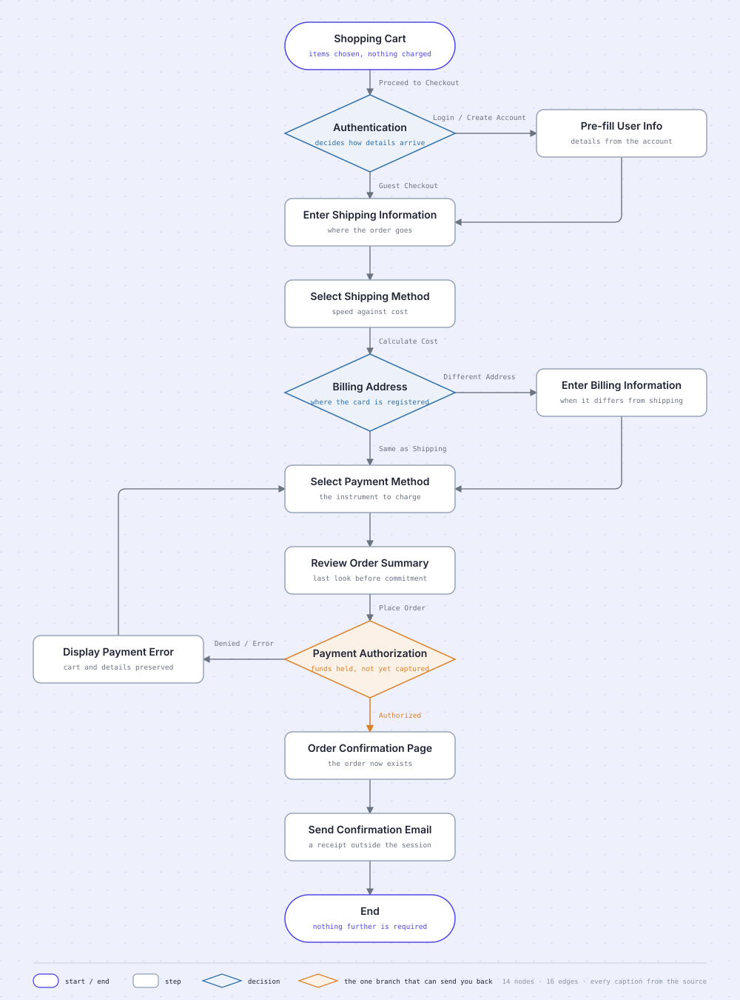
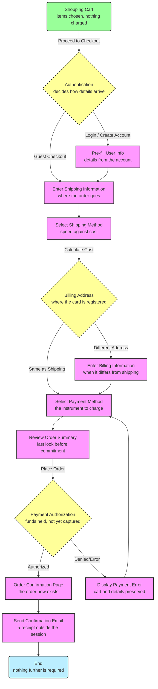

# Online checkout flow

A checkout is the most-abandoned journey in most products, and the usual diagram of it is a wall of
identical boxes. This one keeps every node and edge of its source and changes only how it reads.

## The source

Committed here so the redraw above can be checked against it by anyone, without the conversation
that produced it.

## Why the captions live in the source

The first draft of this diagram was drawn from a source with node names and nothing else. The house
style asks every node to carry a one-line caption, because a bare title in a box reads flat. Those
two facts collide: writing a caption during the redraw means the picture asserts something the
source never said.

So the captions went into the source instead. **"funds held, not yet captured" is a claim about how
card payments work**, and a claim belongs where it can be reviewed, not where it can only be
admired. The redraw then does what it always does — it changes nothing.

This is the general rule. When a diagram needs structure or detail its source does not express,
update the source and redraw. Never infer it while drawing.

## What the redraw changed

**14 nodes in, 14 nodes out. 16 edges in, 16 edges out. Every title, caption, and edge label
verbatim.**

| Changed                                                           | Kept                                                 |
| ----------------------------------------------------------------- | ---------------------------------------------------- |
| Layout — one spine with side spurs, instead of an auto-laid tree  | Every node and edge                                  |
| Colour — the source's `classDef` fills replaced by house tokens   | The class _assignments_, carried by shape and border |
| Routing — rounded elbows, the retry path pulled clear to the left | Edge direction, throughout                           |
| Emphasis — one focal accent                                       | Every label and caption, word for word               |

The distinction in row two is the one that matters. `fill:#f9f` is presentation, so it goes. But
`class PayAuth decision` is a claim about what kind of thing that node is, so it survives — as a
diamond with a blue border rather than as a yellow fill.

## Reading it

**Shapes carry the node's kind**, exactly as the source assigns it:

- **Stadiums** — where the journey starts and ends.
- **Rectangles** — a step someone or something performs.
- **Diamonds** — a branch. Three of them: how you identify yourself, whose address gets billed, and
  whether the payment clears.

**Three spurs leave the spine and rejoin it.** Logging in pre-fills your details and puts you back
on the shipping step. A different billing address is an extra form before payment. Both are detours,
not alternative journeys, and the layout says so by returning them to the same column.

**One branch does not rejoin — it reverses.** A denied payment sends you back up to _Select Payment
Method_, and that back-edge is the only place in the whole flow where the reader travels upward. It
gets the accent for that reason: it is the single point where a checkout stops being a queue and
starts being a loop.

## Why it does not move

Diagram Therapy animates flow, never structure. A checkout is a journey a person takes once, not a
system with throughput, so packets travelling down these connectors would imply a liveness that does
not exist — the exact failure the house rules exist to prevent.

The retry loop is the one edge with a defensible case for motion, because repetition is genuinely
what it depicts. That is a judgment call, not a default, and it is left off here.
