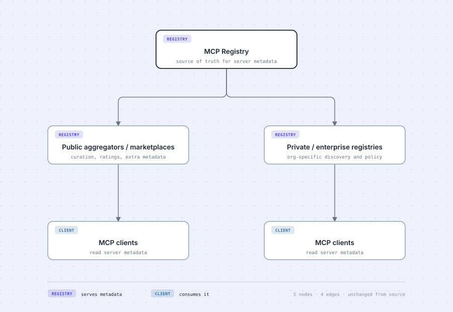
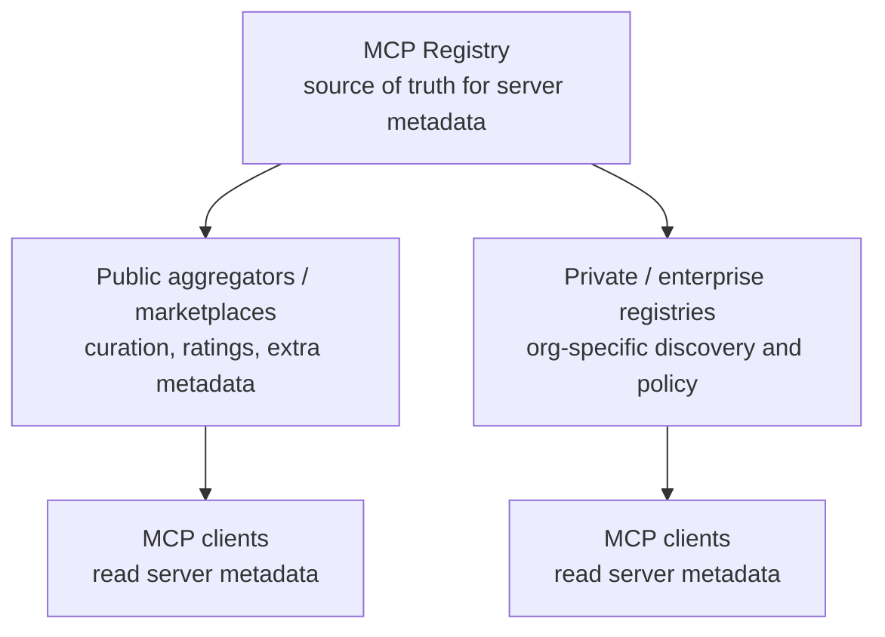

# The MCP Registry ecosystem

Five nodes, four edges, and the smallest diagram in this repository that badges actually improve.
The other two articles — the
[checkout flow](../e-commerce-checkout-flow/e-commerce-checkout-flow.md) and the
[OAuth exchange](../oauth-pkce-flow/oauth-pkce-flow.md) — both leave badges off. This one explains
what changed.

## The source

## When a badge earns its place

A badge is a small chip in a node's corner carrying a category. It is the easiest device in this
style guide to overuse, so it has to pass three tests before it goes in.

**Does more than one node share it?** A diagram where every node has a unique badge has no grouping
— the badges are just labels wearing a costume. Here, `REGISTRY` covers three nodes and `CLIENT`
covers two. Both group.

**Does nearly every node share the same one?** Also a failure. A category almost everything belongs
to is not a category. Three out of five is close to that line, and the badge set survives only
because the remaining two form a real second group rather than a leftover.

**Is the corner free?** Numbered step chips and category badges compete for the same space, and
sequence and category rarely both need showing. Nothing here is numbered, so the corner is free.

The other diagram in this article's source — a developer publishing a package to npm and metadata to
the registry — fails the first test outright. Four nodes, four different kinds of thing, so four
unique badges. That diagram is better with none, and it does not get any.

## Why the cards went quiet

**Badges and colour-by-tier are alternatives, not partners.** Both encode category. Running them
together puts two encodings in conflict on a single node, and the result reads as muddy rather than
as rich.

So when badges carry the category, the cards go neutral. Every node here is white, and the badges do
all the grouping.

**There is no orange in this diagram at all**, and that is deliberate. A node can carry three
encodings at once — role in its shape, category in its badge, focal state in its accent — and three
is one too many. The collision shows up first as a colour clash: an indigo `REGISTRY` chip inside an
orange focal border, fighting it. Recolouring that one chip to match would be worse, because three
nodes share `REGISTRY` and a chip that looks different reads as a different category.

So the third encoding loses. **MCP Registry** is focal by weight rather than hue — a heavier, darker
border against the light grey of everything else. All three `REGISTRY` chips stay identical, the
focal node is still the first one you find, and nothing on the card is fighting anything else.

## What the redraw changed

**5 nodes in, 5 out. 4 edges in, 4 out. Titles and captions verbatim.**

| Changed                                                   | Kept                                   |
| --------------------------------------------------------- | -------------------------------------- |
| Layout — a fork, with the two branches read side by side  | Every node and edge                    |
| Cards neutralised so badges carry the category            | The source's own class assignments     |
| Rounded elbows on the two connectors leaving the registry | Edge direction, throughout             |
| One focal accent                                          | Every title and caption, word for word |

The badges are not an interpretation. `:::registry` and `:::client` are in the source, and the chips
render those assignments — the same rule the checkout flow follows when it turns
`class PayAuth decision` into a diamond.

## Reading it

**One specification, two implementations, one kind of consumer.** The MCP Registry defines an
OpenAPI specification. Public marketplaces and private enterprise registries implement it, and each
serves clients that never have to know which kind of registry they are talking to.

That is what the badges make visible and the arrows do not. Read the shape alone and this is a tree.
Read the badges and it becomes a layered system: a metadata tier that happens to have three members,
and a consumer tier with two. The public and private branches look symmetrical because they are —
they differ in curation and policy, not in role.

## Why it does not move

This is a structural map. Nothing in it flows. Animating packets down these edges would suggest
traffic the diagram does not describe, which is the failure the house rules exist to prevent — and
the reason only two of the four diagrams in this repository move at all.
