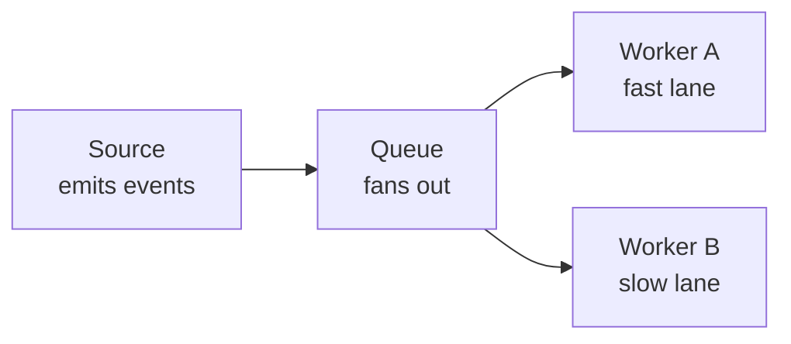

# Event bus fan-out, animated

The file that proved declarative animation survives every surface we publish to. Three staggered
packets enter a queue; two branches drain it at deliberately different rates; the connectors march.
No JavaScript.

## The source

The captions belong in the source, not the drawing. **"fast lane" and "slow lane" are claims about
throughput**, and the redraw backs them by animating the two branches at different durations —
`1.6s` against `2.9s`. Had those captions been invented during the redraw, the motion would have
been illustrating something nobody asserted.

## What it demonstrates

Markdown embeds an `.svg` in an `` context, which the specification calls _secure animated
mode_: scripting off, declarative animation on. Both techniques survive, and both are used here so
that a failure would be diagnosable rather than merely visible.

| Technique                               | Used for                                  | Fails how                                        |
| --------------------------------------- | ----------------------------------------- | ------------------------------------------------ |
| CSS `@keyframes` on `stroke-dashoffset` | Marching connectors, pulsing focal border | Dashes freeze — the `<style>` block was stripped |
| SMIL `<animateMotion>`                  | Packets travelling the connector paths    | Packets freeze — SMIL was stripped               |

Verified 2026-09-01 on GitHub Gists, GitHub repository READMEs, and Obsidian. Everything moved on
all three.

## The accessibility asymmetry

`prefers-reduced-motion` switches off the CSS half. **It cannot switch off SMIL** — there is no
declarative equivalent. A reader with motion sensitivity sees the packets regardless. Where
accessibility leads, keep the motion in the dashes.
