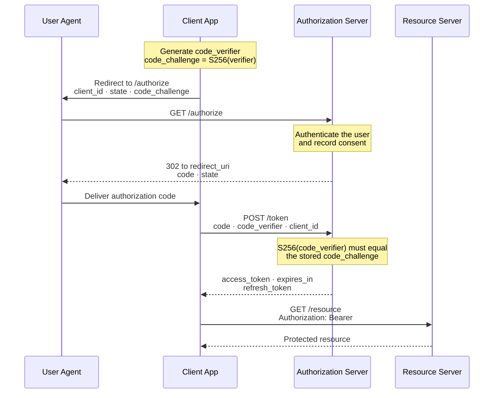

# OAuth 2.0 authorization code flow with PKCE

Four participants, eight messages, and one check that the whole extension exists to add. This is the
companion piece to the [checkout flow](../e-commerce-checkout-flow/e-commerce-checkout-flow.md) —
same house style, opposite answers on captions and on motion, both for reasons the diagram itself
makes visible.

## The source

## Why nothing is captioned

The checkout flow gives every node a one-line caption, because a node named _Payment Authorization_
does not tell you that funds are held rather than captured. Here, not one participant has a caption.

That is not inconsistency. It is the same rule reaching a different answer.

**Caption the thing that carries the claim.** In a flowchart the claims live in the boxes, because a
box is a step and a step has properties worth stating. In a sequence diagram the boxes are _actors_
and the claims live on the _arrows_ — every assertion in this diagram is a message, a parameter, or
a note. Captioning `Authorization Server` with "issues tokens" would restate what its own arrows
already say, and restating the obvious is the fastest way to make a diagram look busy and say less.

A sequence diagram's participants are the one place where a name is genuinely complete.

## Why it moves

The checkout flow is static, because a checkout is a journey one person takes once. Animating it
would suggest throughput that does not exist.

A protocol is the opposite: it is an exchange, it happens in order, and the order is the thing worth
understanding. So a packet travels each message in protocol order, once per cycle. The vertical axis
already encodes sequence — motion is not carrying the meaning here, it is pacing it, which is the
only job motion is allowed.

Every message stays legible with the animation stopped. That is the test.

## What the redraw changed

**4 participants in, 4 out. 8 messages in, 8 out. 3 notes in, 3 out. Labels verbatim.**

| Changed                                                     | Kept                                      |
| ----------------------------------------------------------- | ----------------------------------------- |
| Lifelines and note framing restyled to house tokens         | Every participant, message, and note      |
| Request and response distinguished by solid against dashed  | Message direction, throughout             |
| Parameter lists set in muted type beneath each message name | Every parameter, spelled as in the source |
| One focal accent, on the verification note                  | The order of the exchange                 |

Row two is the only place the redraw adds anything, and it adds no information: `->>` and `-->>`
already distinguish request from response in the source. The dashes make that visible without a
legend lookup.

## Reading it

**PKCE turns a stolen code into a useless one.** Without it, an attacker who intercepts the
authorization code at the redirect can exchange it for a token. With it, the token request must also
carry the `code_verifier`, and only the client that started the flow has it.

Three steps carry the whole mechanism, and they are deliberately far apart:

1. **Before anything else**, the client generates a random `code_verifier` and sends only its
   SHA-256 hash, the `code_challenge`. The secret never crosses the browser.
2. **At the redirect**, the authorization code travels back through the user agent. This is the
   exposed moment — and the code alone is not enough.
3. **At the token request**, the client presents the original `code_verifier`. The server hashes it
   and compares. That is the accented note, and it is the only step PKCE adds to the base flow.

The `state` parameter is doing separate work: it protects against cross-site request forgery, not
code interception. Two parameters, two threats, often confused for each other.

PKCE is specified in [RFC 7636](https://datatracker.ietf.org/doc/html/rfc7636). It was introduced
for public clients that cannot keep a secret — mobile and single-page applications — and current
OAuth security guidance recommends it for confidential clients too.
